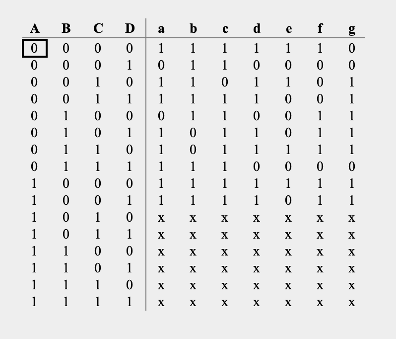

# Description

This is a BCD-to-Seven-Segment truth table.

The circuit has:
- Inputs: 4-bit BCD inputs (A, B, C, D)
- Outputs: Seven-segment outputs (a, b, c, d, e, f, g)

Valid inputs represent decimal digits from 0 to 9.
Input combinations from 1010 to 1111 are treated as Don't Care conditions and are used for logic simplification in Karnaugh Maps.

