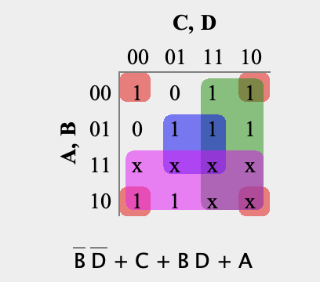
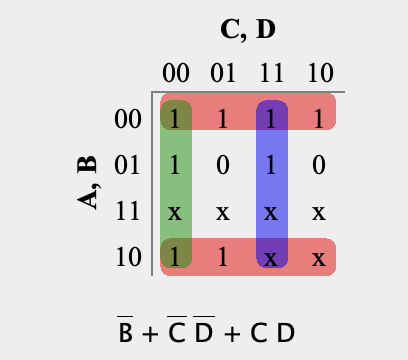
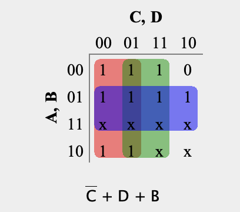
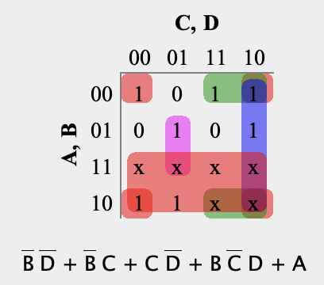
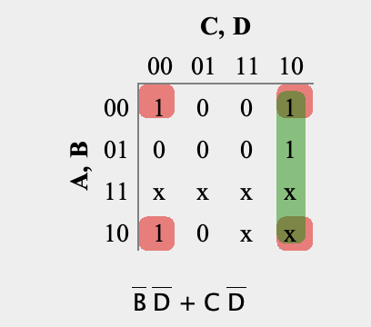
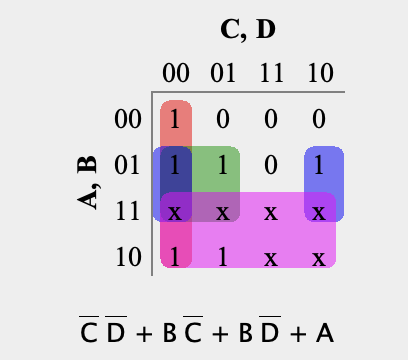
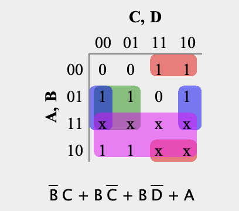

# Description

This section includes the Karnaugh Maps (K-Maps) for each output segment (a–g) of the BCD-to-Seven-Segment Decoder. The K-Maps are used to simplify the Boolean expressions for each segment in order to minimize the logic circuit.

## Segment a

## Segment b

## Segment c

## Segment d

## Segment e

## Segment f

## Segment g

