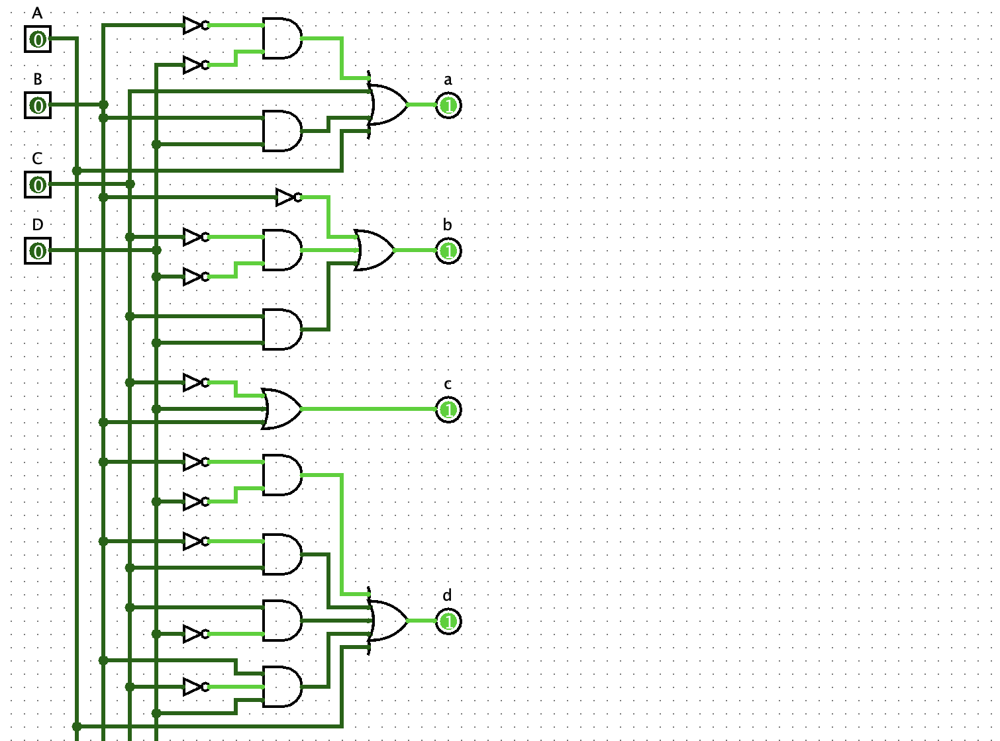
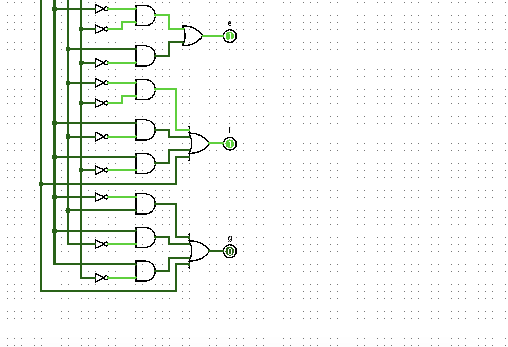

# Logic Circuit Implementation

The BCD-to-Seven-Segment decoder is implemented using combinational logic derived from simplified Boolean expressions. Each output segment (a–g) is constructed using basic logic gates (AND, OR, NOT). The final circuit integrates all segments to produce the correct display output for decimal digits 0–9.

